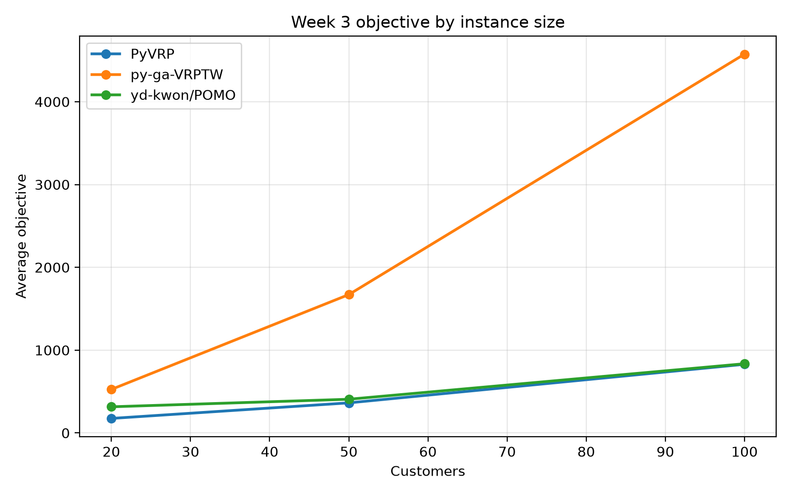
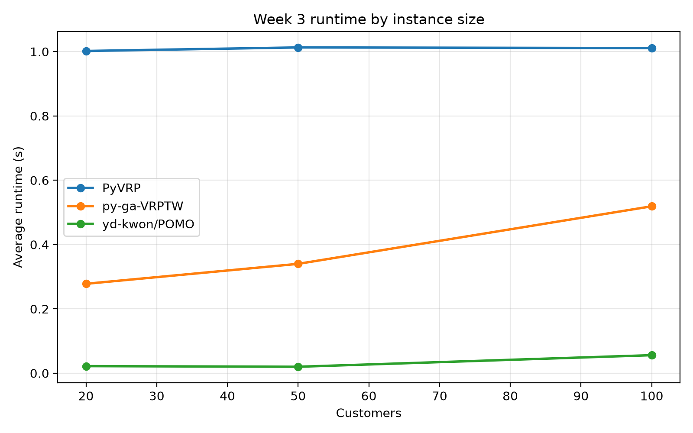
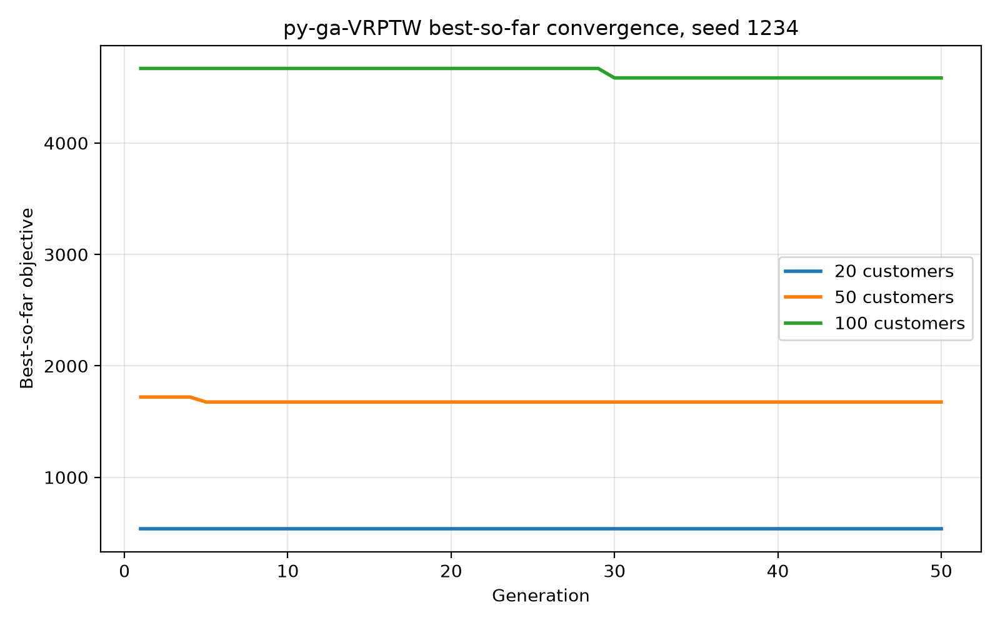
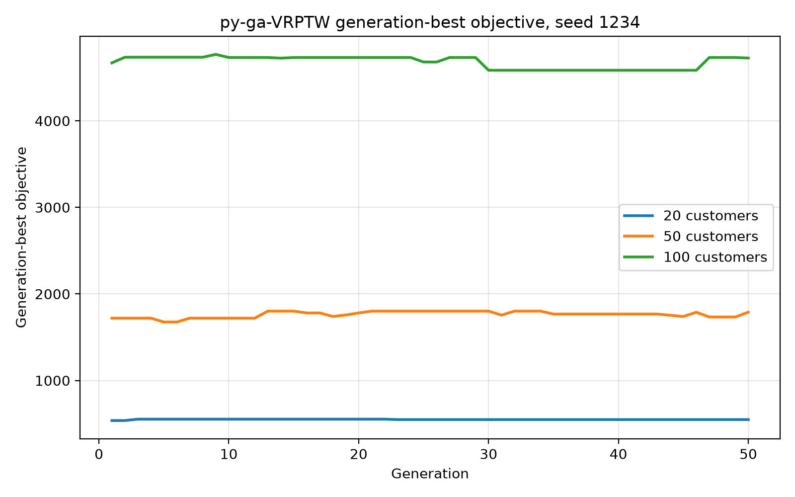

# Week 3 Lab Report: PyVRP vs py-ga-VRPTW vs yd-kwon/POMO


## Step 1: Define the Comparison Target

- Testing method:
  - `yd-kwon/POMO`
- Baselines:
  - `PyVRP`
  - `py-ga-VRPTW`
- Main difference:
  - `yd-kwon/POMO` is a learning-based CVRP policy using the upstream pretrained CVRP100 checkpoint.
  - `PyVRP` uses hybrid genetic search and explicitly enforces VRPTW capacity and time-window constraints.
  - `py-ga-VRPTW` is an external genetic algorithm implementation for Solomon-style VRPTW.
- Question:
  - What is the advantage of POMO, and what does it lose when time-window feasibility is checked?

## Step 2: Choose Fair Test Cases

Initial plan:

- Small and medium: Solomon-style instance set `C101.txt`.
- Large: Holmberger instance set `R1_10_9.txt`.

Final fair comparison used:

- `C101_20`: first 20 customers from `src/data/Solomon/C101.txt`.
- `C101_50`: first 50 customers from `src/data/Solomon/C101.txt`.
- `C101_100`: first 100 customers from `src/data/Solomon/C101.txt`.

Reason: `R1_10_9.txt` has 1000 customers. The external `py-ga-VRPTW` repository only ships Solomon 100-customer JSON instances, and the retained `yd-kwon/POMO` model is a CVRP100 checkpoint. Therefore `R1_10_9` is recorded as a limitation/failure case rather than mixed into an unfair three-method table.

## Step 3: Decide What to Record

For every run, the experiment records:

| Field | Meaning |
|---|---|
| `instance_name`, `instance_size` | Case name and customer count |
| `method_name` | PyVRP, py-ga-VRPTW, or yd-kwon/POMO |
| `objective_value` | Route distance under the post-run checker |
| `runtime_seconds` | Wall-clock runtime |
| `feasibility_status` | Solomon time-window/capacity check result |
| `vehicles_used` | Number of routes/vehicles |
| `constraint_violations` | Missing customers, duplicates, TW violations, capacity violations, depot-return violations |
| `random_seed` | Seed used for stochastic methods |
| `best_solution_found` | Route list |
| `convergence_curve` | Available for py-ga-VRPTW |
| `search_steps` | Generations/population or inference action count |

Raw and cleaned outputs:

- Raw records: [week3_raw_records.csv](../src/results/week3_ind2route_hard_tw/week3_raw_records.csv)
- Aggregated table: [week3_summary_by_method_size.csv](../src/results/week3_ind2route_hard_tw/week3_summary_by_method_size.csv)
- Markdown summary: [week3_summary.md](../src/results/week3_ind2route_hard_tw/week3_summary.md)
- Raw logs/py-ga curves: [raw/](../src/results/week3_ind2route_hard_tw/raw/)

## Step 4: Run Repeated Trials

Repeated trials:

- Seeds: `1234`, `2026`, `114514`.
- Sizes: `20`, `50`, `100`.
- Runs per method: `3 sizes * 3 seeds = 9`.
- Total records: `27`.

Experiment commands:

```bash
cd /Users/emt/Workspace/FURP-2026-Ziru-Huang-EVRP-TW
git submodule update --init external/POMO

src/.venv_pyvrp/bin/python src/experiments/week3_pyga_pyvrp_pomo.py \
  --method pyga \
  --output-dir src/results/week3_ind2route_hard_tw \
  --sizes 20 50 100 \
  --seeds 1234 2026 114514 \
  --pyga-pop-size 80 \
  --pyga-generations 50

src/.venv_pyvrp/bin/python src/experiments/week3_pyga_pyvrp_pomo.py \
  --method pyvrp \
  --output-dir src/results/week3_ind2route_hard_tw \
  --sizes 20 50 100 \
  --seeds 1234 2026 114514 \
  --pyvrp-runtime-seconds 1

PYTHONPYCACHEPREFIX=/tmp/furp_week3_pycache python3 \
  src/experiments/week3_pyga_pyvrp_pomo.py \
  --method pomo \
  --output-dir src/results/week3_ind2route_hard_tw \
  --sizes 20 50 100 \
  --seeds 1234 2026 114514 \
  --device cpu

src/.venv_pyvrp/bin/python src/experiments/week3_pyga_pyvrp_pomo.py \
  --method aggregate \
  --output-dir src/results/week3_ind2route_hard_tw
```

Environment:

- macOS CPU run.
- PyVRP / py-ga environment: `src/.venv_pyvrp`, Python 3.13.9.
- PyVRP version: `0.13.4`.
- DEAP version used by py-ga-VRPTW: `1.4.4`.
- POMO environment: system `python3`, Python 3.9.6, torch `2.8.0`, CUDA unavailable.
- `yd-kwon/POMO` submodule commit: `d7c3d6e`.
- `py-ga-VRPTW` submodule commit: `8e005ca`.
- Updated py-ga route decoder: local `ind2route` now treats customer due times as hard constraints when splitting a permutation into routes.

## Step 5: Organize Results Clearly

Aggregated results:

| Size group | Size | Method | Runs | Feasible rate | Best objective | Avg objective | Std objective | Avg runtime (s) | Avg vehicles | Gap to best observed |
|---|---:|---|---:|---:|---:|---:|---:|---:|---:|---:|
| small | 20 | PyVRP | 3 | 1.000 | 175.374 | 175.374 | 0.000 | 1.002 | 3.000 | 0.000% |
| small | 20 | py-ga-VRPTW | 3 | 1.000 | 497.214 | 525.749 | 20.317 | 0.278 | 8.667 | 183.516% |
| small | 20 | yd-kwon/POMO | 3 | 0.000 | 315.817 | 315.817 | 0.000 | 0.022 | 4.000 | 80.082% |
| medium | 50 | PyVRP | 3 | 1.000 | 363.248 | 363.248 | 0.000 | 1.013 | 5.000 | 0.000% |
| medium | 50 | py-ga-VRPTW | 3 | 1.000 | 1655.543 | 1670.801 | 11.058 | 0.340 | 23.333 | 355.761% |
| medium | 50 | yd-kwon/POMO | 3 | 0.000 | 407.030 | 407.030 | 0.000 | 0.020 | 5.000 | 12.053% |
| large | 100 | PyVRP | 3 | 1.000 | 828.937 | 828.937 | 0.000 | 1.011 | 10.000 | 0.000% |
| large | 100 | py-ga-VRPTW | 3 | 1.000 | 4522.272 | 4574.741 | 39.639 | 0.519 | 54.333 | 445.551% |
| large | 100 | yd-kwon/POMO | 3 | 0.000 | 835.890 | 835.890 | 0.000 | 0.056 | 10.000 | 0.839% |

Figures:









The convergence figure above plots the best-so-far objective, so it becomes flat
after the GA finds no better historical best. The per-generation best objective
is plotted separately below.




## Step 6: Analyze, Do Not Just Display

Objective value:

- PyVRP gives the best feasible objective on all three sizes.
- POMO is very close to PyVRP on 100 customers: best/avg objective `835.890` vs PyVRP `828.937`, only `0.839%` worse by distance.
- POMO is worse on 20 and 50 customers, especially on 20 customers. This matches the fact that the checkpoint is trained for CVRP100, not small custom subsets.
- py-ga-VRPTW becomes feasible after changing `ind2route` to split routes with customer due times as hard constraints, but its objective grows much faster than the other methods.
- The main reason is route fragmentation: py-ga uses many more vehicles than PyVRP to satisfy time windows.

Runtime:

- POMO is the fastest method by far: about `0.022s`, `0.020s`, and `0.056s` for 20/50/100 customers.
- py-ga-VRPTW is also faster than PyVRP in this configuration, and the updated route decoder now makes its solutions feasible under the Solomon time-window checker.
- PyVRP is around `1s` because it was deliberately given `MaxRuntime=1s`.

Feasibility:

- PyVRP and the updated py-ga-VRPTW both have `100%` feasibility under the Solomon time-window/capacity checker.
- POMO has good distance behavior at 100 customers but `0%` TW feasibility because the upstream checkpoint is CVRP-only.
- py-ga-VRPTW achieves feasibility by splitting the GA permutation more aggressively: `ind2route` now checks each customer's due time and waits for early arrivals before updating elapsed time.
- This repair-like decoding raises vehicle counts substantially: average vehicles are `8.667`, `23.333`, and `54.333` for 20/50/100 customers, compared with PyVRP's `3`, `5`, and `10`.

Trade-off:

- POMO's main advantage is inference speed. It produces a full route extremely quickly.
- Its main weakness is constraint mismatch: the model does not know Solomon time windows or EV constraints.
- PyVRP is slower than py-ga/POMO in this setup, but it gives much better feasible route quality.
- py-ga-VRPTW is now a feasible baseline, but it is a weak-quality baseline because the hard time-window split uses too many vehicles.

## Step 7: Discuss Failure Cases

Failure case 1: POMO ignores time windows.

- The POMO checkpoint used here is `yd-kwon/POMO` CVRP100 pretrained checkpoint.
- It handles coordinates, demand, and capacity, but not ready time / due time.
- After post-checking its routes against Solomon time windows, all runs are infeasible.
- This is not a coding crash; it is a modeling mismatch.

Failure case 2: py-ga-VRPTW becomes feasible but uses too many vehicles.

- The updated `ind2route` treats customer due times as hard constraints when decoding a permutation into routes.
- This removes time-window and depot-return violations in the post-checker.
- However, the decoder often opens new routes to preserve feasibility, so vehicle counts become much larger than PyVRP.
- Future work should improve the decoder or add local search/repair so py-ga can satisfy time windows without excessive route fragmentation.

Failure case 3: Holmberger `R1_10_9` was not included in the fair three-way table.

- `R1_10_9` has 1000 customers.
- `py-ga-VRPTW` ships 100-customer Solomon JSON data and its parser assumes the Solomon 100-customer structure.
- The retained POMO checkpoint is CVRP100, so a 1000-customer Holmberger comparison would not answer the same question.
- A fair large-scale experiment should either use methods that all support 1000 customers, or retrain/adapt POMO and convert py-ga inputs carefully.

## Discussion

The results show that POMO's advantage is speed, not feasibility robustness. On the 100-customer case, POMO's route distance is close to PyVRP, which suggests that the learned CVRP policy captures useful routing structure. However, once Solomon time windows are enforced after rollout, the POMO solution fails. Therefore, POMO cannot currently replace a VRPTW/EVRP-TW solver without a time-window-aware model, repair operator, or feasibility layer.

PyVRP is still the strongest baseline for this week because it returns feasible VRPTW solutions consistently within the fixed 1-second runtime while using far fewer vehicles. The updated py-ga-VRPTW decoder is useful as a feasibility baseline, but it is not competitive in solution quality: it achieves `100%` feasibility mainly by splitting routes aggressively around customer time windows.

## Conclusion

This week I compared `PyVRP`, external `py-ga-VRPTW`, and upstream `yd-kwon/POMO` on C101 subsets of 20, 50, and 100 customers with three seeds. POMO is much faster than the heuristic solvers and becomes distance-competitive on 100 customers, but it is infeasible under Solomon time-window checks because the checkpoint is CVRP-only. The updated py-ga-VRPTW route decoder can now produce feasible VRPTW routes, but it does so by using many more vehicles and much longer total distance. PyVRP remains the best practical baseline: slower than POMO and py-ga in this setup, but consistently feasible and much stronger in objective value. The next step should be to either add a smarter repair/checking layer after POMO rollout or improve py-ga's route decoder/local search so time-window feasibility does not require excessive route fragmentation.
